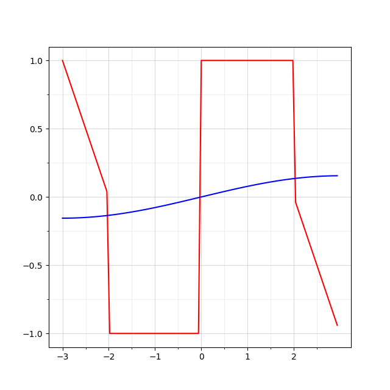

# Визуализация рядов Фурье

Используйте этот python-скрипт для понимания того, как работают ряды Фурье. При правильно рассчитанных коэффициентах ряд будет красиво сходиться к вашей функции.

Пример: ряд Фурье по синусам сходится к непрерывной функции

Больше примеров доступно в **examples**.
